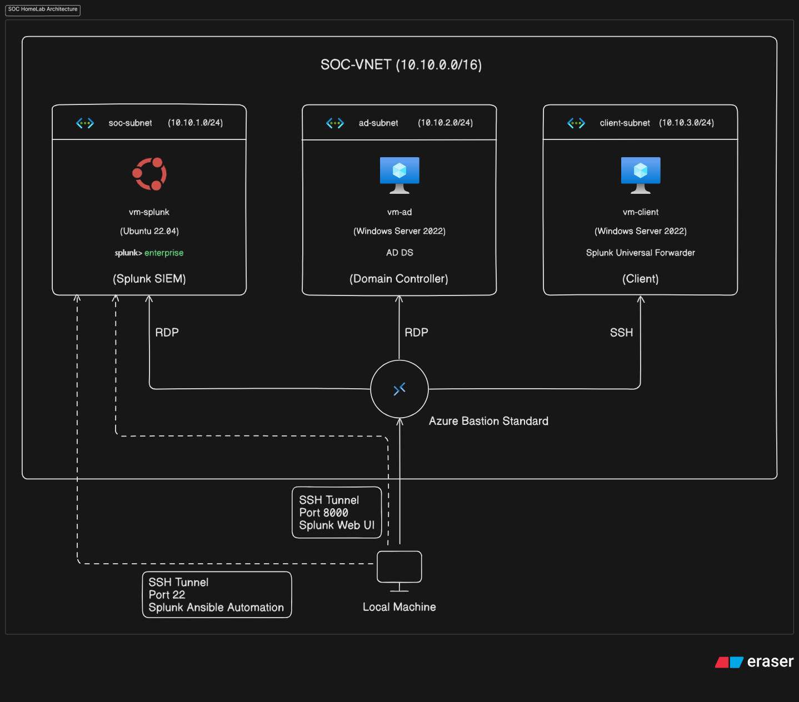
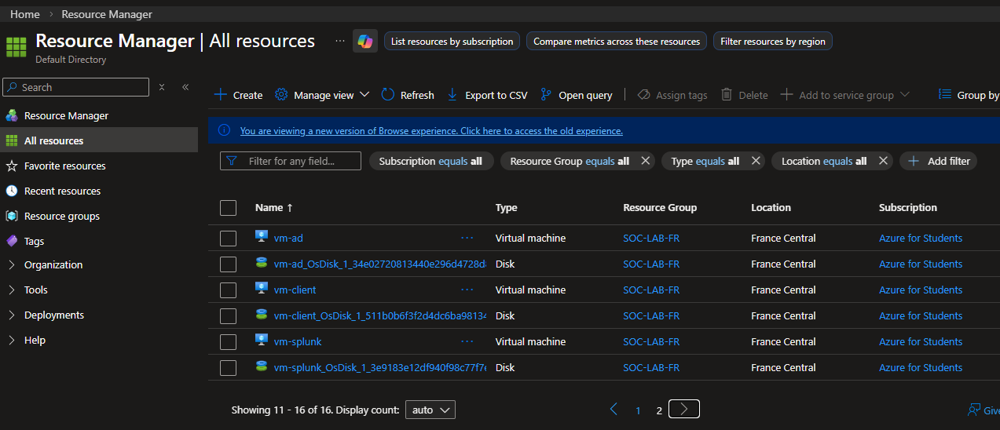
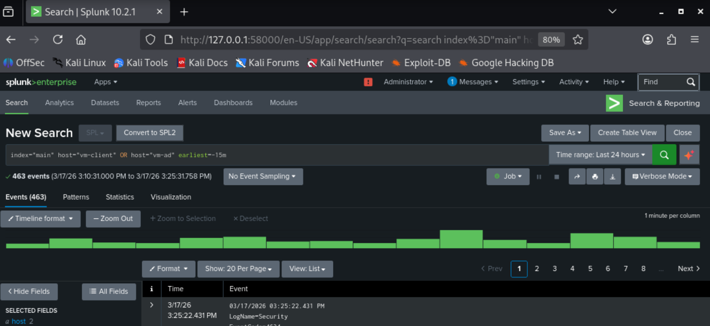
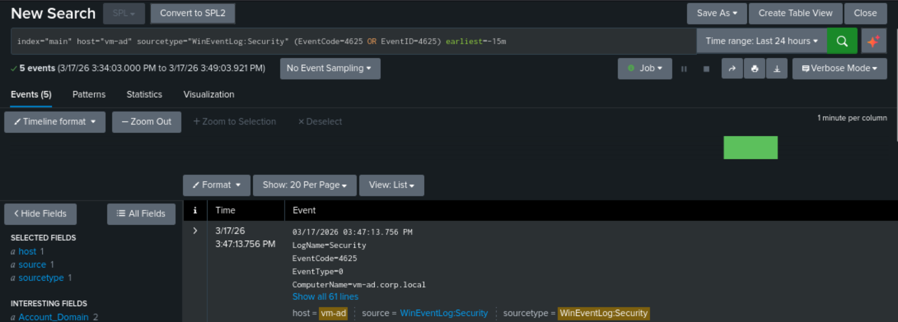
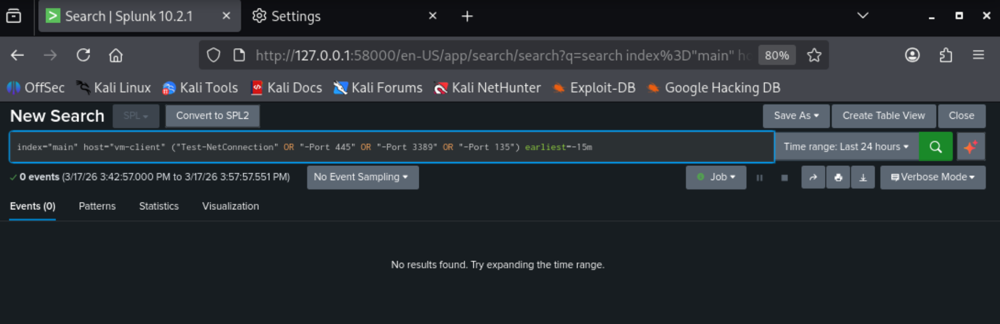
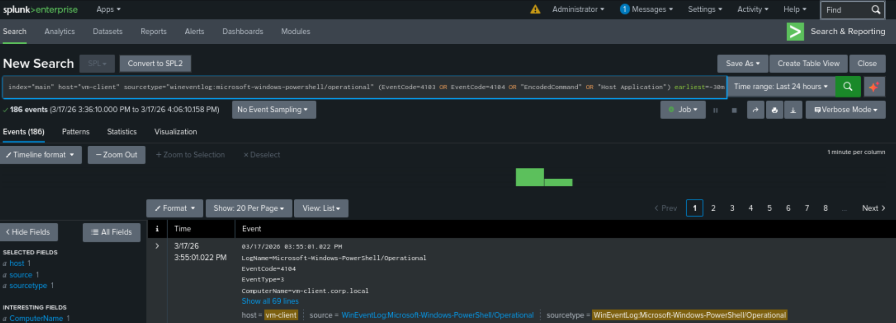
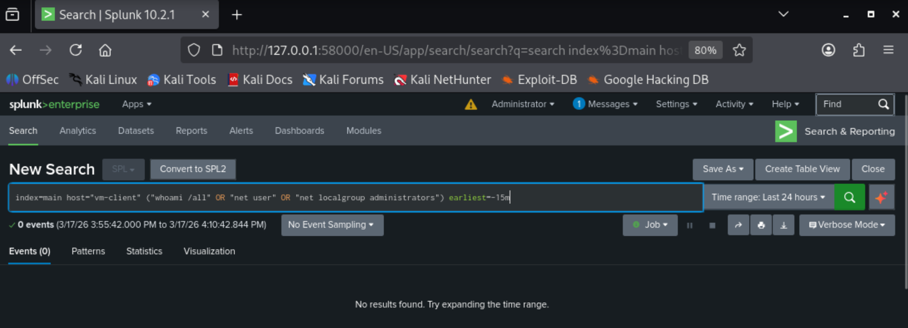
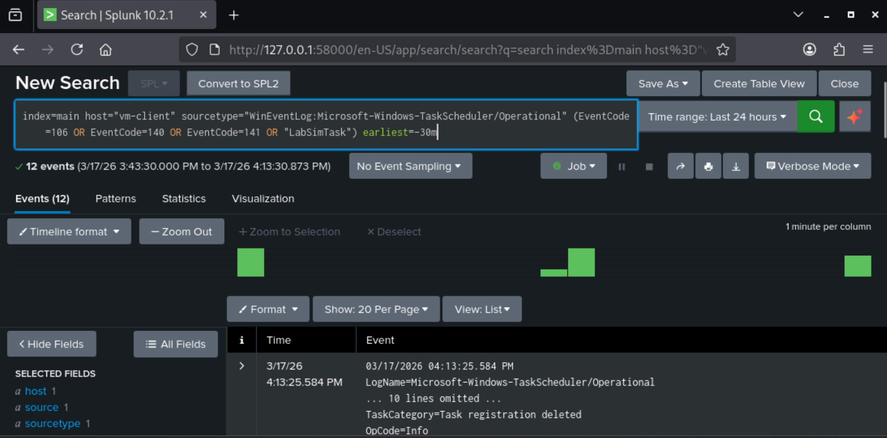
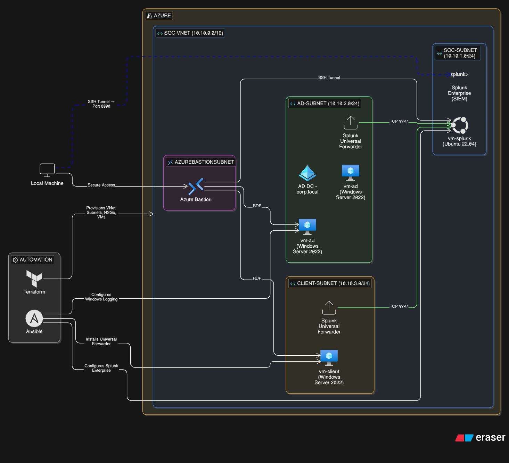

# SOC Homelab on Azure (Terraform + Hybrid Ansible)

## Purpose

This project builds a practical SOC lab in Azure to validate blue-team workflows end-to-end.

- Provision segmented infrastructure with Terraform.
- Build a Windows domain environment (AD + client).
- Deploy and operate Splunk on a Linux SOC host.
- Forward Windows telemetry to Splunk.
- Run controlled attack simulations and verify detections.

This document is the entrypoint for reviewers starting from a clean environment.

## Where To Start

Start here, in this order:

1. Read `terraform/README.md` for infrastructure layout and file design.
2. Read `ansible/ansible_readme.md` for Ansible scope and folder structure.
3. Generate SSH key pair for Splunk access.
4. Run Terraform deployment.
5. Follow `ansible/manual_runbook_windows.md` for Windows setup and validation.
6. Run SOC automation (`ansible/playbooks/soc_run.yml`).
7. Record simulation outcomes in `ansible/evidence_template.md`.

## Prerequisites

- Azure CLI
- Terraform CLI
- Ansible runtime
- Azure CLI Bastion extension
- Contributor access to target Azure subscription/resource group

Install Bastion extension if needed:

```bash
az extension add --name bastion
az extension update --name bastion
```

Generate SSH key pair for Splunk access:

```bash
ssh-keygen -t ed25519 -C "soc_homelab"
```

Use the generated public key path in `terraform/terraform.tfvars` (`public_key`).

## Architecture

Active VM topology:

- `vm-splunk` (Linux, SOC/SIEM)
- `vm-ad` (Windows Server, Domain Controller)
- `vm-client` (Windows Server, domain-joined client/workstation)

Design constraint:

- No dedicated attacker VM is deployed in the current design due to regional core/quota constraints.
- Simulations run from `vm-client`, which still validates telemetry generation, forwarding, ingestion, and detection logic.

SOC HomeLab Topology

## Build Workflow

### Phase 1: Provision Infrastructure

What happens:

- Terraform creates networking, Bastion, NSGs, and all three VMs.

Run from `terraform/`:

```bash
terraform init -upgrade
terraform fmt
terraform validate
az login --tenant <tenant-id>
terraform plan -out tfplan
terraform apply tfplan
```

Azure Platform

### Phase 2: Verify Base Infrastructure Health

What happens:

- You confirm all resources are healthy before guest OS/domain configuration.

Checks in Azure portal:

1. Confirm `vm-ad`, `vm-client`, and `vm-splunk` are running.
2. Check boot diagnostics for each VM.
3. Validate expected private IPs (SOC `10.10.1.4`, AD `10.10.2.4`, client `10.10.3.4`).

### Phase 3: Configure Windows Manually

What happens:

- `vm-ad` becomes domain controller.
- `vm-client` joins domain.
- Forwarders are installed and configured on Windows VMs.

Runbook:

- Follow `ansible/manual_runbook_windows.md`.
- Use explicit user-context and terminal separation instructions from that runbook.

### Phase 4: Configure SOC Components

What happens:

- Splunk is configured and validated through SOC-only Ansible automation.

Start Bastion tunnel to Splunk SSH:

```bash
SPLUNK_ID=$(az vm show -g SOC-LAB-FR -n vm-splunk --query id -o tsv)
az network bastion tunnel --name soc-bastion --resource-group SOC-LAB-FR --target-resource-id "$SPLUNK_ID" --resource-port 22 --port 50022 --timeout 1800
```

Run from `ansible/`:

```bash
ansible-playbook -i inventory/hosts.ini playbooks/soc_run.yml
```

Optional validation-only run:

```bash
ansible-playbook -i inventory/hosts.ini playbooks/soc_validation.yml
```

### Phase 5: Validate Detections

What happens:

- You run controlled simulations and verify Splunk detections.

Evidence tracker:

- Use `ansible/evidence_template.md` as the canonical run log.

## Splunk Web Access

Use a separate terminal for this SSH local forwarding command:

```bash
ssh -i ~/.ssh/azure/id_ed25519 -p 50022 -L 58000:127.0.0.1:8000 azureuser@127.0.0.1
```

SSH Local Forwarding

Note: If you have known_hosts issues, clear the relevant SSH known_hosts entry, then retry the above command:

`optional: if host key verification fails, run this command to clear the old entry:`
```bash
ssh-keygen -f "/home/kali/.ssh/known_hosts" -R "[127.0.0.1]:50022"
```

Then open:

```text
http://127.0.0.1:58000
```

Proceed to log in with the admin credentials you set in `ansible/inventory/group_vars/all.yml` (`splunk_web_username` and `splunk_admin_password`).

After logging in, you can run searches to verify data ingestion and detection logic.
i.e.

```spl
index=main (host="vm-client" OR host="vm-ad") earliest=-15m
```

Splunk Ingestion

If you have issues accessing Splunk Web, verify the SSH tunnel is active and the correct ports are forwarded.

If HTTPS fails, verify protocol on `vm-splunk`:

```bash
curl -vk https://127.0.0.1:8000
curl -v http://127.0.0.1:8000
```
---
Move on to the next section in the `manual_runbook_windows.md` for the simulation matrix and execution instructions, and refer to the evidence tracker template for recording outcomes. Continue to Phase 4, Client Attack Simulation (manual), in `manual_runbook_windows.md` for the first simulation.

---

## Simulation Matrix

Below are the Splunk searches for the simulations in the manual runbook, along with expected detection patterns.

SIM-01: Failed authentication pattern (SMB)

SIM-02: Recon/lateral movement style connectivity probes

SIM-03: Simulated ransomware behavior (file creation + process execution)

SIM-04: Simulated data exfiltration (base64 encoding + uncommon external connection)

SIM-05: Simulated persistence activity (new service creation)

These searches can be run in the Splunk Search & Reporting app to validate that the simulated activities are generating the expected telemetry and triggering the detection logic.

---
This is the final architectural overview for the soc homelab, showing the segmented network design, VM roles, and connectivity paths. This diagram should be referenced when reviewing the Terraform code to understand how the infrastructure is structured and how the components interact.

SOC HomeLab Architecture

## Operational Note: VM Recovery Only If Needed

This guide assumes clean apply from scratch. If a VM later becomes unstable (for example Bastion reconnect failures or guest OS hangs), replace only that VM:

```bash
terraform plan -replace="azurerm_windows_virtual_machine.ad_vm" -out tfplan-replace
terraform apply tfplan-replace
```

Use equivalent `-replace` target for `vm-client` or `vm-splunk` when needed.

## Teardown After Lab Completion

Run from `terraform/`:

```bash
terraform plan -destroy -out tfdestroy
terraform apply tfdestroy
```

## Security Recommendations

1. Replace `admin_source_ip_cidr = "0.0.0.0/0"` with a trusted `/32`.
2. Move secrets out of tracked files (`terraform.tfvars`, `ansible/inventory/group_vars/all.yml`).
3. Rotate all lab credentials before any shared/demo use.
4. Prefer environment variables, secret stores, or encrypted files (for example Ansible Vault) for sensitive values.
