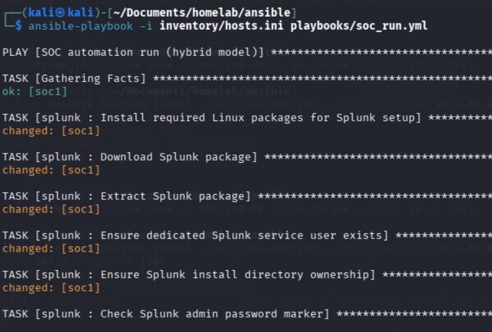
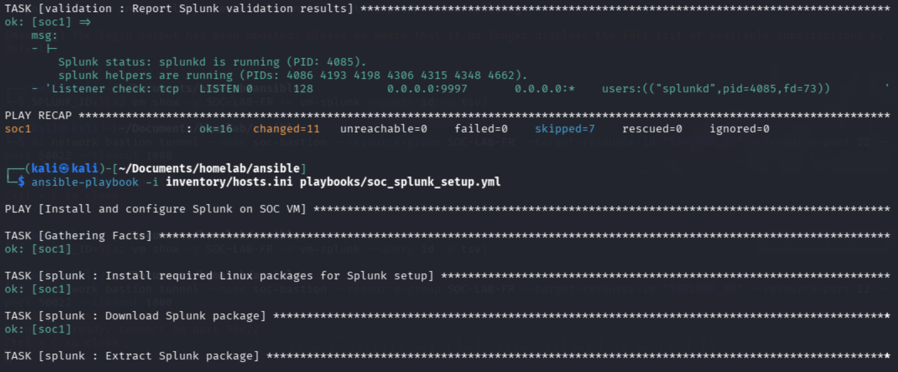
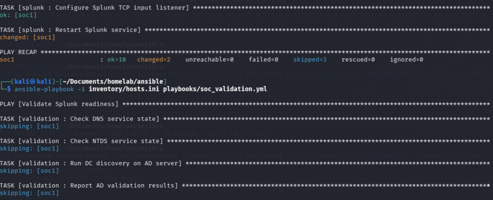

# Ansible in This Project

## Purpose

Ansible is intentionally limited to SOC-side Linux automation in this lab.

- Splunk install and configuration on `vm-splunk`.
- SOC-side validation checks (service status and listener checks).
- No Windows domain automation in this active design.

Windows-heavy operations remain manual in `manual_runbook_windows.md` for reliability and clear operator control.

This document is a structural guide for reviewers, not a step-by-step Windows operations runbook.

## Execution Boundary

- Terraform: infrastructure provisioning and lifecycle.
- Manual Windows runbook: AD promotion, domain join, forwarders, simulations.
- Ansible: Splunk setup and SOC validation only.

## Current Folder Structure

```text
ansible/
  ansible_readme.md
  ansible.cfg
  evidence_template.md
  manual_runbook_windows.md
  inventory/
    hosts.ini
    group_vars/
      all.yml
  playbooks/
    soc_run.yml
    soc_splunk_setup.yml
    soc_validation.yml
  roles/
    splunk/
      tasks/
        main.yml
    validation/
      tasks/
        main.yml
```

## File-by-File Reference

- `ansible.cfg`
  Contains controller-side Ansible defaults.

- `inventory/hosts.ini`
  Declares SOC host and optional Windows host entries used by this lab.

- `inventory/group_vars/all.yml`
  Shared variables for playbooks and roles (domain/Splunk settings).

- `playbooks/soc_run.yml`
  Main entrypoint. Runs Splunk setup then SOC validation.

- `playbooks/soc_splunk_setup.yml`
  Setup-only execution for Splunk role.

- `playbooks/soc_validation.yml`
  Validation-only execution for SOC checks.

- `roles/splunk/tasks/main.yml`
  Installs Splunk, seeds admin password, enables boot start, configures listener, restarts service.

- `roles/validation/tasks/main.yml`
  Verifies Splunk service and listener readiness.

- `manual_runbook_windows.md`
  Canonical manual runbook for Windows-side operations and simulations.

- `evidence_template.md`
  Canonical evidence tracker for simulation execution and detection outcomes.

## How To Run Ansible Here

Before running Ansible, ensure you have completed the Terraform deployment and followed the manual Windows runbook.

Make sure the bastion tunnel is active for `vm-splunk` access, follow up on the setup provided in root documentation `README.md` on Phase 4, with `--resource-port 22 --port 50022 --timeout 1800` to ensure the tunnel remains open for Ansible SSH access.

Run from `ansible/`:

```bash
ansible-playbook -i inventory/hosts.ini playbooks/soc_run.yml
```

Optional focused runs:

```bash
ansible-playbook -i inventory/hosts.ini playbooks/soc_splunk_setup.yml
ansible-playbook -i inventory/hosts.ini playbooks/soc_validation.yml
```

SOC RUN

SOC SETUP

SOC VALIDATION

Move to the next section in the root `README.md` for Splunk Web access instructions in Phase 5.

## Notes for Reviewers

- This folder is purposefully not a full infrastructure orchestrator.
- It is a focused SOC automation layer that complements Terraform and manual Windows operations.
- Duplicate operational instructions are intentionally centralized in `manual_runbook_windows.md`.

## Future Improvements

1. Move sensitive values out of `group_vars/all.yml` into Ansible Vault or external secret management.
2. Add environment-specific inventories (`inventory/dev`, `inventory/prod-like`) for safer scaling.
3. Add idempotence and lint checks in CI (`ansible-lint`, syntax checks, dry-runs).
4. Add post-deploy health checks that query Splunk ingestion directly.
