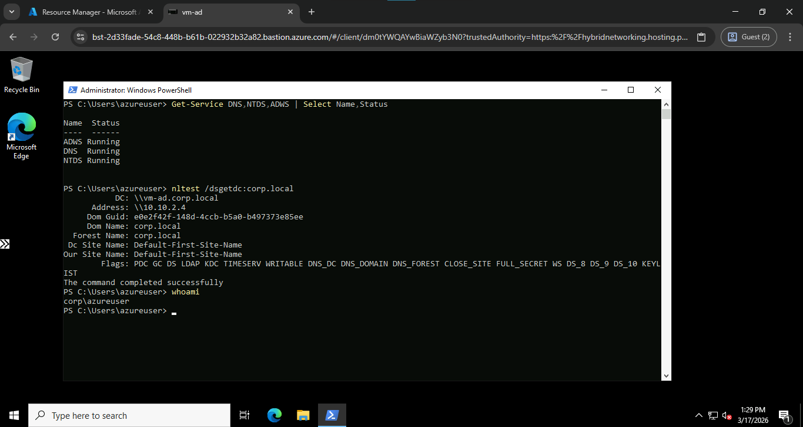
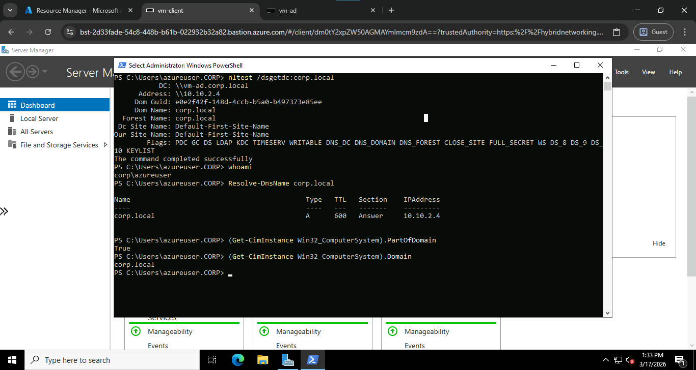
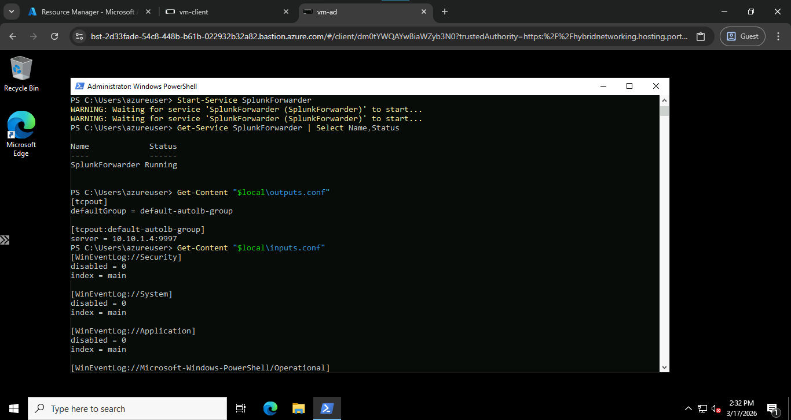
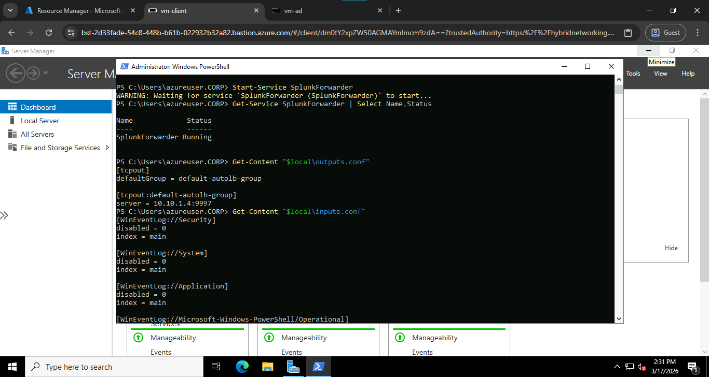

# Manual Windows Runbook (Hybrid Mode)

Use Azure Bastion portal access for Windows-heavy steps that are sensitive to reboot, identity context, and WinRM timing.

## 0) Access and Terminal Plan

Access requirements:

- Use Azure Bastion RDP from the Azure portal for all Windows VM operations.
- Use separate RDP sessions for `vm-ad` and `vm-client`.
- Use elevated PowerShell (`Run as Administrator`) for all VM commands in this runbook.

Terminal separation for Splunk Web access:

- Terminal A (local): Bastion SSH tunnel to `vm-splunk` (`local:50022`).
- Terminal B (local): SSH local forwarding (`local:58000 -> vm-splunk:8000` through `50022`).
- Browser: open `http://127.0.0.1:58000`.

### 0.1 Commands Run (Section 0)

```bash
# Terminal A
SPLUNK_ID=$(az vm show -g SOC-LAB-FR -n vm-splunk --query id -o tsv)
az network bastion tunnel --name soc-bastion --resource-group SOC-LAB-FR --target-resource-id "$SPLUNK_ID" --resource-port 22 --port 50022 --timeout 1800

# Terminal B
ssh -i ~/.ssh/azure/id_ed25519 -p 50022 -L 58000:127.0.0.1:8000 azureuser@127.0.0.1
```

## 1) AD VM (`vm-ad`)

Access and user context:

- Access path: Azure Bastion RDP to `vm-ad`.
- Login user before promotion: local VM admin (for example `azureuser`).
- Shell context: elevated PowerShell.

1. Connect with Azure Bastion (RDP) from the Azure portal.
2. Open PowerShell as Administrator.
3. Check AD DS role state:

```powershell
Get-WindowsFeature AD-Domain-Services
```

4. Install AD DS role if needed:

```powershell
Install-WindowsFeature AD-Domain-Services -IncludeManagementTools
```

5. Promote to domain controller if not already promoted:

```powershell
Install-ADDSForest -DomainName corp.local -InstallDNS:$true -SafeModeAdministratorPassword (ConvertTo-SecureString "<AD_SAFE_MODE_PASSWORD>" -AsPlainText -Force) -Force:$true
```

6. Reboot when prompted.
7. Validate services after reboot:

```powershell
Get-Service DNS,NTDS,ADWS | Select Name,Status
nltest /dsgetdc:corp.local
```

### 1.1 Commands Run (Section 1)

```powershell
Get-WindowsFeature AD-Domain-Services
Install-WindowsFeature AD-Domain-Services -IncludeManagementTools
Install-ADDSForest -DomainName corp.local -InstallDNS:$true -SafeModeAdministratorPassword (ConvertTo-SecureString "<AD_SAFE_MODE_PASSWORD>" -AsPlainText -Force) -Force:$true
Get-Service DNS,NTDS,ADWS | Select Name,Status
nltest /dsgetdc:corp.local
```

AD VM

## 2) Client VM (`vm-client`)

Access and user context:

- Access path: Azure Bastion RDP to `vm-client`.
- Login user: local VM admin, then use domain credentials for join action.
- Shell context: elevated PowerShell.

1. Connect with Azure Bastion (RDP).
2. Set DNS to AD private IP (`10.10.2.4`).

```powershell
Get-DnsClientServerAddress -AddressFamily IPv4
Set-DnsClientServerAddress -InterfaceAlias "Ethernet" -ServerAddresses 10.10.2.4
Get-DnsClientServerAddress -AddressFamily IPv4
```

3. Join domain from PowerShell:

```powershell
$pw = ConvertTo-SecureString "<DOMAIN_ADMIN_PASSWORD>" -AsPlainText -Force
$cred = New-Object System.Management.Automation.PSCredential("<DOMAIN_ADMIN_USER>", $pw)
Add-Computer -DomainName corp.local -Credential $cred -Force -Restart
```

Use a valid domain admin account for your environment (for example `CORP\azureuser` or `azureuser@corp.local`).
Do not assume `CORP\Administrator` exists or is enabled.

4. Validate after reboot:

```powershell
nltest /dsgetdc:corp.local
whoami
```

Expected:

- `whoami` should return a domain context when logged in as a domain user (for example `corp\azureuser`).
- If `Add-Computer` says the machine is already in the domain, skip rejoin and proceed.

Client VM

### 2.1 Commands Run (Section 2)

```powershell
Get-DnsClientServerAddress -AddressFamily IPv4
Set-DnsClientServerAddress -InterfaceAlias "Ethernet" -ServerAddresses 10.10.2.4
Get-DnsClientServerAddress -AddressFamily IPv4
$pw = ConvertTo-SecureString "<DOMAIN_ADMIN_PASSWORD>" -AsPlainText -Force
$cred = New-Object System.Management.Automation.PSCredential("<DOMAIN_ADMIN_USER>", $pw)
Add-Computer -DomainName corp.local -Credential $cred -Force -Restart
nltest /dsgetdc:corp.local
whoami
```

### 2.2 If `whoami` still shows local context after domain join

if whoami still is vm-client\azureuser, you can close the RDP session (the vm-client tab) and start a new one on the azure platform on bastion section, then login with `azureuser@corp.local` and check `whoami` again.

In the case where, you are trying to login with `azureuser@corp.local` and it shows warning's like the `the network is unstable` or it keeps reconnecting without logging in, check the `Monitor` section on the azure portal for the `vm-client`, if it is unavailable, go to the `Connect` section then there will be an option to start the VM, start it, wait for like 10 seconds and try to login again with `azureuser@corp.local`.

or you can run this command to run as the domain user without logging out:

```powershell
runas /user:CORP\azureuser powershell
```

This will open a new PowerShell window under the domain user context. In that new window, run `whoami` to confirm the domain context.

## 3) Windows Forwarder Setup (on both `vm-ad` and `vm-client`)

Access and user context:

- Access path: Azure Bastion RDP to each VM separately.
- Login user: `CORP\azureuser`.
- Shell context: elevated PowerShell.
- Verify identity on each VM with `whoami`.

Run these on both Windows VMs (`vm-ad` and `vm-client`).

1. Download and install Splunk Universal Forwarder MSI:

```powershell
$fwUrl = "https://download.splunk.com/products/universalforwarder/releases/10.2.0/windows/splunkforwarder-10.2.0-d749cb17ea65-windows-x64.msi"
$msi   = "C:\Windows\Temp\splunkforwarder.msi"

Invoke-WebRequest -Uri $fwUrl -OutFile $msi
Start-Process msiexec.exe -ArgumentList "/i `"$msi`" AGREETOLICENSE=Yes LAUNCHSPLUNK=0 /qn" -Wait
```

2. Configure `outputs.conf`:

```powershell
$local = "C:\Program Files\SplunkUniversalForwarder\etc\system\local"
New-Item -ItemType Directory -Force -Path $local | Out-Null

@"
[tcpout]
defaultGroup = default-autolb-group

[tcpout:default-autolb-group]
server = 10.10.1.4:9997
"@ | Set-Content -Path "$local\outputs.conf" -Encoding ASCII
```

3. Configure `inputs.conf`:

```powershell
@"
[WinEventLog://Security]
disabled = 0
index = main

[WinEventLog://System]
disabled = 0
index = main

[WinEventLog://Application]
disabled = 0
index = main

[WinEventLog://Microsoft-Windows-PowerShell/Operational]
disabled = 0
index = main

[WinEventLog://Microsoft-Windows-TaskScheduler/Operational]
disabled = 0
index = main
"@ | Set-Content -Path "$local\inputs.conf" -Encoding ASCII
```
VM AD Splunk Forwarder

VM Client Splunk Forwarder

4. Ensure forwarder service is running:

```powershell
Get-Service SplunkForwarder | Select Name,Status
Start-Service SplunkForwarder
Get-Service SplunkForwarder | Select Name,Status
```

5. Verify local config files:

```powershell
Get-Content "$local\outputs.conf"
Get-Content "$local\inputs.conf"
```

6. Verify ingestion in Splunk (only when Splunk Web is accessible, which is after running the Ansible playbook to configure Splunk):

Now you can proceed to run the Ansible playbook to configure Splunk. More details are available in `ansible_readme.md` and the root readme `README.md` documentation.

```spl
index=main (host="vm-client" OR host="vm-ad") earliest=-15m
```

### 3.1 Commands Run (Section 3)

```powershell
whoami
Invoke-WebRequest -Uri $fwUrl -OutFile $msi
Start-Process msiexec.exe -ArgumentList "/i `"$msi`" AGREETOLICENSE=Yes LAUNCHSPLUNK=0 /qn" -Wait
New-Item -ItemType Directory -Force -Path $local | Out-Null
Set-Content -Path "$local\outputs.conf" -Encoding ASCII
Set-Content -Path "$local\inputs.conf" -Encoding ASCII
Get-Service SplunkForwarder | Select Name,Status
Start-Service SplunkForwarder
Get-Service SplunkForwarder | Select Name,Status
Get-Content "$local\outputs.conf"
Get-Content "$local\inputs.conf"
```

```spl
index=main (host="vm-client" OR host="vm-ad") earliest=-15m
```

## 4) Client Attack Simulation (manual)

Access and user context:

- Access path: Azure Bastion RDP to `vm-client`.
- Login user: `CORP\azureuser`.
- Shell context: PowerShell on `vm-client` for simulation.
- Splunk side: query from browser via forwarded local URL.

Use controlled, lab-only actions and record evidence:

- Test ID
- Start/end timestamp (UTC preferred)
- Exact command run
- Splunk query used
- Result (`detected`, `not detected`, `noisy`)

### 4.1 Pre-checks

On `vm-client`:

```powershell
whoami
Get-Service SplunkForwarder | Select Name,Status
```

In Splunk Search app (after confirming Splunk Web access):

```spl
index=main host="vm-client" sourcetype="WinEventLog:Security" earliest=-15m
```

### 4.2 Simulation Matrix

#### SIM-01: Failed authentication pattern (SMB)

Run on `vm-client` PowerShell as `CORP\azureuser`:

```powershell
1..5 | ForEach-Object {
    cmd /c "net use \\10.10.2.4\IPC$ /user:corp\fakeuser WrongPassword123!" | Out-Null
}
```

Suggested query:

```spl
index=main host="vm-ad" sourcetype="WinEventLog:Security" (EventCode=4625 OR EventID=4625) earliest=-15m
```


SIM-01: Failed authentication pattern (SMB)

#### SIM-02: Recon/lateral movement style connectivity probes

Run on `vm-client` PowerShell as `CORP\azureuser`:

```powershell
Test-NetConnection -ComputerName 10.10.2.4 -Port 445
Test-NetConnection -ComputerName 10.10.2.4 -Port 3389
Test-NetConnection -ComputerName 10.10.2.4 -Port 135
```

Suggested query:

```spl
index=main host="vm-client" ("Test-NetConnection" OR "-Port 445" OR "-Port 3389" OR "-Port 135") earliest=-15m
```

Observed in this lab: currently `not detected` due to insufficient command-content telemetry.


#### SIM-03: Suspicious PowerShell style execution

Run on `vm-client` PowerShell as `CORP\azureuser`:

```powershell
powershell.exe -NoProfile -EncodedCommand SQBlAHgAIAAnAFMAdQBzAHAAaQBjAGkAbwB1AHMAUABvAHcAZQByAFMAaABlAGwAbABBAGMAdABpAHYAaQB0AHkAJwA=
```

Suggested query:

```spl
index=main host="vm-client" ("EncodedCommand" OR "powershell.exe -NoProfile") earliest=-15m
```

and then tune to include Operational fields after enabling that channel:

```spl
index=main host="vm-client" sourcetype="WinEventLog:Microsoft-Windows-PowerShell/Operational" (EventCode=4103 OR EventCode=4104 OR "EncodedCommand" OR "Host Application") earliest=-30m
```

#### SIM-04: Local enumeration behavior

Run on `vm-client` PowerShell as `CORP\azureuser`:

```powershell
whoami /all
net user
net localgroup administrators
```

Suggested query:

```spl
index=main host="vm-client" ("whoami /all" OR "net user" OR "net localgroup administrators") earliest=-15m
```

Observed in this lab: currently `not detected` under baseline telemetry.


#### SIM-05: Scheduled task persistence-style pattern

Run on `vm-client` PowerShell as `CORP\azureuser`:

```powershell
$taskName = "LabSimTask"
schtasks /create /tn $taskName /tr "cmd.exe /c echo lab-sim" /sc once /st 23:59 /f
schtasks /query /tn $taskName
schtasks /delete /tn $taskName /f
```

Suggested query:

```spl
index=main host="vm-client" sourcetype="WinEventLog:Microsoft-Windows-TaskScheduler/Operational" (EventCode=106 OR EventCode=140 OR EventCode=141 OR "LabSimTask") earliest=-30m
```

Observed in this lab: `detected` after tuning (TaskScheduler Operational channel).


### 4.2.1 Commands Run (Section 4.2)

```text
Use the per-simulation command blocks listed in SIM-01 through SIM-05.
```

### 4.3 Evidence Template

Use `ansible/evidence_template.md` as the canonical tracker.

```text
Test ID:
Host:
Start time:
End time:
Command:
Splunk query:
Observed event IDs / fields:
Result:
Notes / tuning changes:
```

### 4.4 Interpretation Guidance

- If telemetry appears but query does not match: tune detection logic.
- If telemetry does not appear: check forwarder service and `inputs.conf` coverage first.
- If results are too noisy: add filters for user, host, command pattern, or time window.

### 4.4.1 Commands Run (Section 4.4)

```text
No shell commands. Interpretation-only section.
```

### 4.5 Suggested Execution Cadence

1. Run one simulation at a time.
2. Wait 1-3 minutes for ingestion.
3. Run the mapped query and record result.
4. Tune query if needed, then rerun the same simulation.
5. Move to next simulation only after current one is repeatable.

### 4.5.1 Commands Run (Section 4.5)

```text
No direct command block. Use SIM-01 through SIM-05 command blocks.
```

## 5) What Ansible Still Automates

Run from local machine in `ansible/`:

```bash
ansible-playbook -i inventory/hosts.ini playbooks/soc_run.yml
```

This handles Splunk on `vm-splunk` and SOC-side validation only.

### 5.1 Commands Run (Section 5)

```bash
ansible-playbook -i inventory/hosts.ini playbooks/soc_run.yml
```

## 6) Access Splunk Web from Local Machine (Validated)

Use this after `soc_run.yml` succeeds.

Terminal and access requirements:

- Terminal A (local): Bastion SSH tunnel stays open.
- Terminal B (local): SSH local forward stays open.
- Browser: local web access while both terminals remain active.

1. Start Bastion tunnel (Terminal A):

```bash
SPLUNK_ID=$(az vm show -g SOC-LAB-FR -n vm-splunk --query id -o tsv)
az network bastion tunnel --name soc-bastion --resource-group SOC-LAB-FR --target-resource-id "$SPLUNK_ID" --resource-port 22 --port 50022 --timeout 1800
```

2. Start local port forward (Terminal B):

```bash
ssh -i ~/.ssh/azure/id_ed25519 -p 50022 -L 58000:127.0.0.1:8000 azureuser@127.0.0.1
```

3. Open browser:

```text
http://127.0.0.1:58000
```

4. Login:

- Username: `admin`
- Password: value of `splunk_admin_password` in `ansible/inventory/group_vars/all.yml`

### 6.1 If HTTPS fails with SSL errors

Run on `vm-splunk` shell:

```bash
curl -vk https://127.0.0.1:8000
curl -v http://127.0.0.1:8000
```

In this lab, Splunk Web responded on HTTP, so use `http://127.0.0.1:58000`.

### 6.1.1 Commands Run (Section 6.1)

```bash
curl -vk https://127.0.0.1:8000
curl -v http://127.0.0.1:8000
```

### 6.2 Verify ingestion after login

Run in Splunk Search app:

```spl
index=main (host="vm-client" OR host="vm-ad") earliest=-15m
```

If no results, widen window:

```spl
index=main earliest=-24h | stats count by host sourcetype
```

### 6.2.1 Commands Run (Section 6.2)

```spl
index=main (host="vm-client" OR host="vm-ad") earliest=-15m
index=main earliest=-24h | stats count by host sourcetype
```

### 6.3 Commands Run (Section 6)

```bash
# Terminal A
SPLUNK_ID=$(az vm show -g SOC-LAB-FR -n vm-splunk --query id -o tsv)
az network bastion tunnel --name soc-bastion --resource-group SOC-LAB-FR --target-resource-id "$SPLUNK_ID" --resource-port 22 --port 50022 --timeout 1800

# Terminal B
ssh -i ~/.ssh/azure/id_ed25519 -p 50022 -L 58000:127.0.0.1:8000 azureuser@127.0.0.1
```
